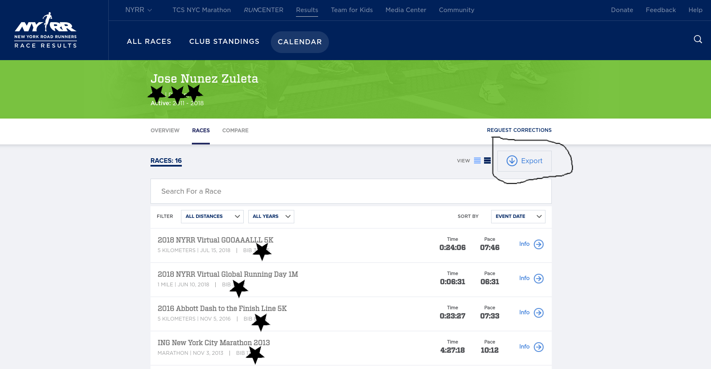
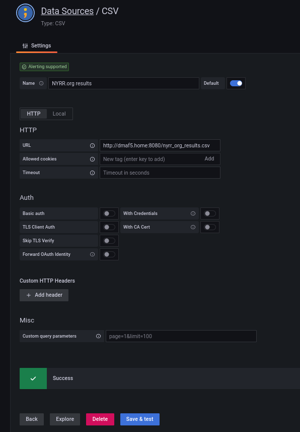
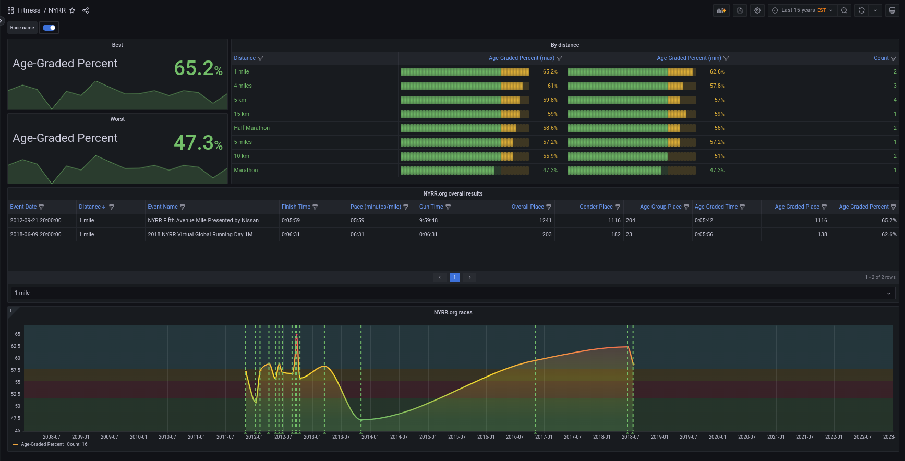
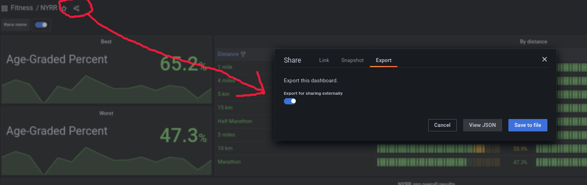

# Building a Grafana dashboard to visualize your NYRR.org race results using Ansible, Podman and Buildah

If you live or work in New York and like running you may have run one of the New York Road Running races.  You may know 
perhaps one of their most famous races, the [NYRR Marathon](https://en.wikipedia.org/wiki/New_York_City_Marathon).

So [who are they](https://www.nyrr.org/about)?

> Our history is rich because we run with passion. It all started with a local running club made up of just 40 people, but over the past 60+ years, committed runners have joined us in droves. Time, commitment, and our never-ending mission to help and inspire people through running have led us to become the world’s premier community running organization.

Over the years I ran many of their races, and it is not surprise they have one of the biggest databases of races for many distances (like 5K, Marathon). Curious, I downloaded a full list of my race results into Excel format, massaged it a bit and then started asking more questions.

In this tutorial I will show how to:

* Set up a Podman container that provides access to your race history in CSV format
* Set up a CSV data-source in Grafana
* Create a dashboard that shows multiple views of the same data, including annotations.


## Requirements
* Ability to install software as root on a Linux distribution (I used Fedora, feel free to run anything else you like)
* Python 3. Comes pre-installed on most Linux distributions
* Podman. Don't worry, I will show you how to install it later.
* Grafana (running in a container, but a bare-metal installation also works). Also with the ability to install plugins, like the CSV plugin.

But the most important requirement is curiosity.

Right now, let's install Ansible (if it is not there) so you can get started. In Fedora you can install Ansible using DNF:

```shell
sudo dnf -y install ansible
```

For other distributions, consult [Ansible install instructions.](https://docs.ansible.com/ansible/latest/installation_guide/installation_distros.html)

You also need some extra tools for Ansible, like Podman support:

```shell
ansible-galaxy collection install containers.podman
```

## The data file

Once you download your data from their webpage in Excel format, you need to do a bit of editing and export the resulting file to CSV:



The resulting CSV looks more or less like this:

```text
Event Name,Event Date,Distance,Finish Time,Pace,Gun Time,Overall Place,Gender Place,Age-Group Place,Age-Graded Time,Age-Graded Place,Age-Graded Percent
2018 NYRR Virtual GOOAAALLL 5K,07/15/2018,5 km,0:24:06,07:46,0:24:06,516,469,59,0:22:02,375,58.97
2018 NYRR Virtual Global Running Day 1M,06/10/2018,1 mile,0:06:31,06:31,0:06:31,203,182,23,0:05:56,138,62.57
2016 Abbott Dash to the Finish Line 5K,11/05/2016,5 km,0:23:27,07:33,0:29:40,1055,819,94,0:21:44,723,59.76
ING New York City Marathon 2013,11/03/2013,Marathon,4:27:18,10:12,4:29:56,27160,19238,4046,4:19:57,21389,47.30
```

The resulting CSV is very simple, no need for further transformations.

Next step is to make this CSV file available over HTTP, so it can be used by Grafana. For that you will use a Podman container.

## Making sure you have the proper tools installed

Next step is to write an Ansible playbook, [with the suggested structure](https://docs.ansible.com/ansible/latest/tips_tricks/sample_setup.html) where you put files, templates, and the instructions to get everything installed and started in the proper order.  

The resulting Ansible playbook ([nyrr_podman_provisioning.yaml](roles/races/nyrr_podman_provisioning.yaml))

```yaml
- name: Tasks to get a NYRR race dashboards up and running
  hosts: localhost
  tasks:
  - name: Toolchain preparation
    block:
      - name: Install Podman
        ansible.builtin.dnf:
          name: podman
          state: installed
        become: true
    tags: toolchain
```

Then run it with `ansible-playbook --tags toolchain roles/races/nyrr_podman_provisioning.yaml` to install Podman.

## Creating the web application to provide the NYRR results CSV over HTTP

The application is fairly simple:

* Serve a static file over HTTP, the [python3.11 slim image](https://hub.docker.com/_/python) will work just well:
* Only need to drop the race results CSV file on the ```/home/josevnz/fitness``` directory (or similar directory on your machine) and the webserver will pick it up. You can use ([nyrr_org_results.csv](roles/races/files/nyrr_org_results.csv)) to get you started.
* To visualize the results, you will use containerized Grafana with a few pre-installed plugins

### Chicken-and-egg problem with the Grafana container

We have a classic "_what was first, the chicken or the egg_" problem here, because:
1. You need a Grafana instance running, in order to setup a datasource and then implement the dashboard, but you want to be able to restore your Grafana instance easily, most likely on a more powerful server
2. You could argue you can create a datasource first, then spin a Grafana container and then implement the dashboard. But that is not how things are done in reality.

You can see that Ansible is not needed for the test Grafana instance, but still a bit of automation is desired (like installing custom plugins).

I will run both the home_fitness webserver and the Grafana containers from the same location, also because we will mount the CSV from out home directory we need to pass a special [SELinux flag](https://docs.podman.io/en/v3.4.2/markdown/podman-run.1.html#labeling-volume-mounts) so the container can use the mounted file.

```shell
podman run --name nyrr_server --publish 8080:8080 --security-opt label=disable --volume /home/josevnz/fitness/nyrr_org_results.csv:/mnt/nyrr_org_results.csv:ro --restart=always --detach --workdir /mnt python:3.11-slim python3 -m http.server 8080
1c0c23ad9240c8b606bb1c9e8d585b89e1b7718d15c81088f25533f34c3b03b6
```

Then using a tool like curl you can try to download the processed copy of the NYRR race results:

```shell
[josevnz@dmaf5 NYRR]$ curl --fail --verbose --silent --url http://localhost:8080/nyrr_org_results.csv
*   Trying 127.0.0.1:8080...
* Connected to localhost (127.0.0.1) port 8080 (#0)
> GET /nyrr_org_results.csv HTTP/1.1
> Host: localhost:8080
> User-Agent: curl/7.85.0
> Accept: */*
> 
* Mark bundle as not supporting multiuse
* HTTP 1.0, assume close after body
< HTTP/1.0 200 OK
< Server: SimpleHTTP/0.6 Python/3.11.1
< Date: Thu, 02 Feb 2023 02:30:45 GMT
< Content-type: text/csv
< Content-Length: 1775
< Last-Modified: Thu, 02 Feb 2023 01:16:26 GMT
< 
Event Name,Event Date,Distance,Finish Time,Pace,Gun Time,Overall Place,Gender Place,Age-Group Place,Age-Graded Time,Age-Graded Place,Age-Graded Percent
2018 NYRR Virtual GOOAAALLL 5K,07/15/2018,5 km,0:24:06,07:46,0:24:06,516,469,59,0:22:02,375,58.97
2018 NYRR Virtual Global Running Day 1M,06/10/2018,1 mile,0:06:31,06:31,0:06:31,203,182,23,0:05:56,138,62.57
2016 Abbott Dash to the Finish Line 5K,11/05/2016,5 km,0:23:27,07:33,0:29:40,1055,819,94,0:21:44,723,59.76
ING New York City Marathon 2013,11/03/2013,Marathon,4:27:18,10:12,4:29:56,27160,19238,4046,4:19:57,21389,47.30
NYC Half 2013,03/17/2013,Half-Marathon,1:42:31,07:50,1:50:39,2322,1760,277,1:39:42,1989,58.56
Grete's Great Gallop in Support of AKTIV Foundation,10/14/2012,Half-Marathon,1:48:34,08:17,1:51:27,1508,1154,237,1:45:02,1267,56.00
NYRR Fifth Avenue Mile Presented by Nissan,09/22/2012,1 mile,0:05:59,05:59,9:59:48,1241,1116,204,0:05:42,1116,65.19
Fitness Games Men,09/15/2012,4 miles,0:29:07,07:17,0:29:55,480,480,97,0:27:43,535,61.00
Percy Sutton Harlem 5K Run,08/25/2012,5 km,0:23:50,07:41,0:25:10,975,771,130,0:22:42,803,57.00
Achilles Hope & Possibility,06/24/2012,5 miles,0:38:38,07:44,0:39:05,386,326,75,0:37:18,409,57.17
Celebrate Israel,06/03/2012,4 miles,0:30:04,07:31,0:31:52,856,748,143,0:28:38,829,59.00
UAE Healthy Kidney 10K,05/12/2012,10 km,0:49:15,07:56,0:51:29,1886,1567,308,0:47:49,1728,55.89
New York Colon Cancer Challenge 15K,04/01/2012,15 km,1:12:47,07:49,1:13:13,651,544,118,1:09:53,594,59.00
NYRR Gridiron Classic,02/05/2012,4 miles,0:30:28,07:37,0:33:45,1173,960,174,0:29:15,1099,57.80
Joe Kleinerman 10K,01/07/2012,10 km,0:55:05,08:52,0:59:35,2423,1708,316,0:52:51,1850,51.00
NYRR Dash to the Finish Line (5K),11/05/2011,5 km,0:23:36,07:36,0:25:32,593,471,90,0:22:40,562,57.28
* Closing connection 0
```

Or a simpler way, which you will use for the container self health check:

```shell
python3 -c 'import urllib.request; import sys; urllib.request.urlopen("http://localhost:8080/nyrr_org_results.csv").readlines(); sys.exit(0)' && echo "SUCCESS"|| echo "FAILURE"
```

Next you will do something similar to spin a throw away Grafana instance that you will use for development

### Throw away Grafana instance

Again, let's create another container, [this time for Grafana](https://grafana.com/docs/grafana/latest/setup-grafana/installation/docker/#alpine-image-recommended):

```shell
podman run --rm --detach --publish 3000:3000 --name=grafana_test --env "GF_INSTALL_PLUGINS=marcusolsson-csv-datasource,marcusolsson-json-datasource" grafana/grafana-oss:latest
porman logs --follow grafana_test
```

The container [can be customized further](https://grafana.com/docs/grafana/latest/setup-grafana/configure-docker/), to include required plugins and persistent volumes, when is restarted the installation data will be preserved.

Time to focus on visualizing the race results.

### Creating and provisioning the datasource and the dashboard

Once the instance is up, you can log in the first time with user `admin` and password `admin`. Then, add a CSV datasource (example shown below):



Designing the Dashboard is something you do by interactively, and most likely after several attempts you end up having something that you like.

So let's outline the steps for this one:

1. Show a time series with the age graded percentile (best, worst)
2. A table showing overall race results, with the ability to filter

A detailed tutorial [on how create](https://grafana.com/docs/grafana/latest/dashboards/build-dashboards/create-dashboard/) and [best practices](https://grafana.com/docs/grafana/latest/dashboards/build-dashboards/best-practices/) for dashboards is beyond the scope of this tutorial, but you can see the end results of creating a dashboard:



To be able to treat this as code, [export the dashboard definition](https://grafana.com/docs/grafana/latest/dashboards/manage-dashboards/) as JSON and save it to a file:



To provision as code, tell Grafana where it can pick the dashboards ([default.yaml](roles/races/templates/grafana/provisioning/dashboards/default.yaml.j2)):

```yaml
apiVersion: 1
providers:
  - name: Jose dashboards providers
    type: file
    updateIntervalSeconds: 10
    options:
      path:
        /etc/grafana/provisioning/dashboards
      foldersFromFilesStructure: true
```

The dashboard you exported earlier ([[NYRR-1675298041762.json](roles/races/files/grafana/provisioning/dashboards/racing/NYRR-1675298041762.json)]) will be also copied to the right directory.

Next we will take care of the datasource. The datasource can also be defined as a yaml file on a special directory ([nyrr_race_results_datasouce](roles/races/templates/grafana/provisioning/datasources/nyrr_race_results_datasource.yaml.j2)):

```yaml
apiVersion: 1
datasources:
  - name: DS_NYRR.ORG_RESULTS
    type: marcusolsson-csv-datasource
    uid: "{{ datasource_id }}"
    url: "http://{{ nyrr_service_host }}:8080/{{ nyrr_race_results_file }}"
    editable: true
    jsonData:
      storage: http
```

Note that you can use Jinja expressions to refine the datasource behaviour, like passing overrides to the plugin. Do it on a special plugin file, [csv.yaml](roles/races/templates/grafana/provisioning/plugins/csv.yaml.j2)

```yaml
---
apiVersion: 1
apps:
  - type: marcusolsson-csv-datasource
    org_id: 1
    disabled: false
    jsonData:
      allow_local_mode: true
```

All these artifacts are deployed on an external volume that is mounted by the Grafana container.

To recap you now have the following:

1. Web server to provide the race results over HTTP
2. A CSV datasource that can ingest the CSV file
3. A Dashboard to display the results

Time to provision all the pieces using Ansible.

### Launching the containers from Ansible

Ansible offers support for [podman](https://docs.ansible.com/ansible/latest/collections/containers/podman/index.html), so you can augment the previous playbook with extra instructions.

At the end, your [nyrr_podman_provisioning.yaml](roles/races/nyrr_podman_provisioning.yaml) looks like this:

```yaml
---
- name: Tasks to get a NYRR race dashboards up and running
  hosts: localhost
  vars:
    race_results_dir: /home/josevnz/raceresults # Update this path
    grafana_data_dir: /home/josevnz/grafana_raceresults_data # Update this path
    nyrr_race_results_file: nyrr_org_results.csv
    datasource_id: 948e72a8-a6cc-11ed-a1ef-1c8341284421 # uuidgen --time
    nyrr_service_host: dmaf5.home # Replace with your host name
    nyrr_service_port: 8080
    nyrr_service_tag: 3.11-slim
    grafana_plugins: marcusolsson-csv-datasource,marcusolsson-json-datasource
    grafana_service_port: 3000
  tasks:
    - name: Toolchain preparation
      tags: toolchain
      ansible.builtin.dnf:
        name: podman
        state: installed
      become: true
    - name: Provision data services
      tags: data_services
      block:
        - name: Copy NYRR race results to {{ race_results_dir }}
          tags: copy_service_files
          ansible.builtin.copy:
            dest: "{{ race_results_dir }}/"
            src: "{{ nyrr_race_results_file }}"
            directory_mode: a+xr
            mode: a+r,u+w
        - name: Python3 image
          tags: pull_service_image
          containers.podman.podman_image:
            name: python
            tag: "{{ nyrr_service_tag }}"
        - name: Launch containers required to see the race results
          tags: launch_nyrr_data
          containers.podman.podman_container:
            init: true
            name: "nyrr_server"
            image: "python:{{ nyrr_service_tag }}"
            command: "python3 -m http.server {{ nyrr_service_port }}"
            state: started
            security_opt:
              label=disable
            restart_policy: "always"
            detach: true
            workdir: /mnt
            rm: false
            ports:
              - "{{ nyrr_service_port }}:{{ nyrr_service_port }}"
            expose:
              - "{{ nyrr_service_port }}"
            volumes:
              - "{{ race_results_dir }}/{{ nyrr_race_results_file }}:/mnt/{{ nyrr_race_results_file }}:ro"
            healthcheck: "python3 -c 'import urllib.request; import sys; urllib.request.urlopen(\"http://localhost:{{ nyrr_service_port }}/{{ nyrr_race_results_file }}\").readlines(); sys.exit(0)'"
            healthcheck_retries: 3
            healthcheck_start_period: "10s"
    - name: Provision visualization services
      tags: visualization_services
      block:
        - name: Copy Grafana artifacts to final location
          tags: copy_visualization_files
          ansible.builtin.copy:
            dest: "{{ race_results_dir }}/"
            src: "{{ nyrr_race_results_file }}"
            directory_mode: a+xr
            mode: a+r,u+w
        - name: Grafana image
          tags: pull_service_image
          containers.podman.podman_image:
            name: "grafana/grafana-oss"
            tag: "latest"
        - name: Provisioning directories {{ grafana_data_dir }}
          tags: grafana_provision_dirs
          ansible.builtin.file:
            path: "{{ grafana_data_dir }}/provisioning/{{ item }}"
            mode: "ugo+xr,u+w"
            state: "directory"
            recurse: true
          loop:
            - access-control
            - alerting
            - dashboards/racing
            - datasources
            - notifiers
            - plugins
        - name: Launch Grafana container
          tags: launch_grafana
          containers.podman.podman_container:
            init: true
            name: "grafana_races"
            image: "grafana/grafana-oss:latest"
            state: started
            security_opt:
              label=disable
            restart_policy: "always"
            detach: true
            rm: false
            env:
              GF_INSTALL_PLUGINS: "{{ grafana_plugins }}"
            ports:
              - "{{ grafana_service_port }}:{{ grafana_service_port }}"
            expose:
              - "{{ grafana_service_port }}"
            volumes:
              - "{{ grafana_data_dir }}/provisioning:/etc/grafana/provisioning:rw"
        - name: Deploy files to provision directories
          tags: files_grafana
          ansible.builtin.copy:
            dest: "{{ grafana_data_dir }}/{{ item | replace('files/grafana/', '') }}"
            src: "{{ item }}"
            mode: a+r,u+w
          loop:
            - files/grafana/provisioning/dashboards/racing/NYRR-1675298041762.json
        - name: Deploy templates to provision directories
          tags: templates_grafana
          ansible.builtin.template:
            dest: "{{ grafana_data_dir }}/{{ item | replace('templates/grafana/', '') | replace('.j2', '') }}"
            src: "{{ item }}"
            mode: a+r,u+w
          loop:
            - templates/grafana/provisioning/dashboards/default.yaml.j2
            - templates/grafana/provisioning/datasources/nyrr_race_results_datasource.yaml.j2
            - templates/grafana/provisioning/plugins/csv.yaml.j2
```

Note that for this to work on your environment, you will have to change some paths.

## Running the Ansible playbook

Below is a capture of how the whole provisioning looks on my computer, plus a few quick inspection of the two running containers:

[](https://asciinema.org/a/559222)


## Race results dashboard in action

The whole vide of the Grafana instance, freshly created is here:

[](https://youtu.be/fx1_n_vibWk "NYRR Race Results in Grafana dashboard")


## Conclusion

* There are other visualization tools out there, I like Grafana because is Open Source, workflow is easy to understand and the results are good but feel free to try anything else with your data.
* You don't need a database to be able to manage your running data. A simple CSV or JSON file can be used for that purpose, but you can always make your datastore more sophisticated.
* Grafana ecosystem has other tools out there that can help you [manage your datasources as code](https://grafana.com/tutorials/provision-dashboards-and-data-sources/), allowing you to automate even more your process. In particular I like [grafyaml](https://docs.openstack.org/infra/grafyaml/) as is well documented and mature.
* If you need to perform more complex tasks while provisioning your Grafana instances with Ansible, you may want to explore the [ansible-grafana](https://github.com/cloudalchemy/ansible-grafana) project. It uses Grafana REST API to perform very complex provisioning tasks with ease (keep in mind the project seems to be stale).
* Finally, support your non-profit local racing club. For example NYRR promotes [youth running](https://www.nyrr.org/youth) and over the years have helped to build community relationships not just New York state but with people from all over the world. If you like running, please consider participating in their organized races, donating or volunteering.
